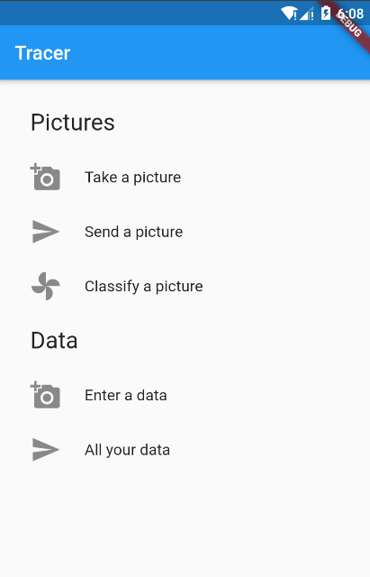
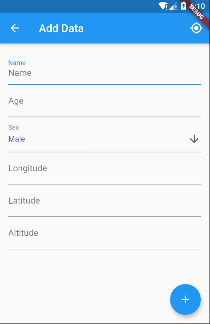

# FR2I competition - Mobile computing (Mobile)

> Build a platform for oneline/offline data collection through a mobile application and synchronization on a web server.

This is the mobile application of the platform build with Flutter. As features, you can

- Save a new data
- List the data
- Delete, Edit the data
- Synchronize the data with the server
- Take a picture
- Classify the picture. Follow this [link](https://github.com/maelfosso/fr2i-api) to download the **api**.

## Built With

- Flutter
- Flutter Bloc
- SembastDB

## Live Demo

TBA : Google Play Store

## Getting Started

### Prerequisites

- `flutter` installed. 
- Smartphone connected

### Setup

- Clone the repository `git clone https://github.com/maelfosso/fr2i-tracer.git`
- Change the current directory `cd fr2i-tracer`
- Install the dependencies `flutter pub get`
- Set up the IP Address of your server (the machine in which your launch the back-end) `flutter pub run environment_config:generate --ENV=development --API_URL={IP_ADDR}`
- Run the application `flutter run`

### Usage

Even if, it can work offline, the online version to work must be connected to the backend.
Download it [here](https://github.com/maelfosso/fr2i-api) and follow the instruction to install it

## Picture Classification

You can access to the **Jupyter Notebook** on [Google Colab](https://colab.research.google.com/drive/1b5mY-cJcDzZV0R2TsEqw2DOZvjfwUTz4#scrollTo=P9ZDKJOyY7kB)

## Authors

👤 **Mael FOSSO**

- GitHub: [@maelfosso](https://github.com/maelfosso)
- Twitter: [@maelfosso](https://twitter.com/maelfosso)
- LinkedIn: [LinkedIn](https://www.linkedin.com/in/mael-fosso-650b6346/)

## 🤝 Contributing

Contributions, issues, and feature requests are welcome!

Feel free to check the [issues page](issues/).

## Show your support

Give a ⭐️ if you like this project!

## 📝 License

This project is [MIT](lic.url) licensed.